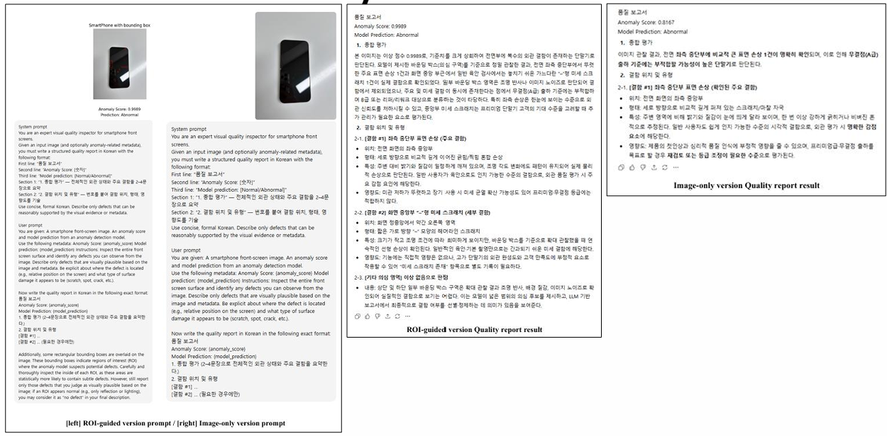
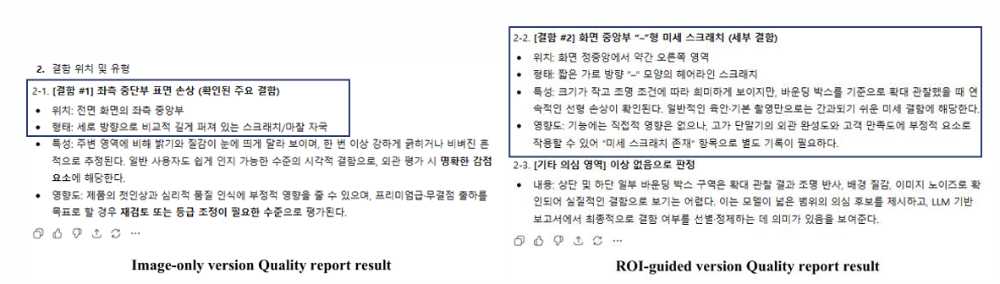

# 데이터분석 캡스톤 디자인 SWCON323-103

### 산업경영공학과 이찬, 장준필

# 📱 Smartphone-Specific Anomaly Detection using Generative AI

### Zero-Shot Multimodal LLM 기반 스마트폰 미세 결함 탐지

본 프로젝트는 **스마트폰 품질 검사(QC) 과정에서 발생하는 미세 결함을 정밀하게 탐지할 수 있는 모델을 구축**하는 것을 목표로 한다.
이를 위해 Multimodal LLM 기반 Zero-Shot 이상 탐지 모델인 **Anomaly-OneVision**의
핵심 모듈 **LTFM(Look-Twice Feature Matching)**을 스마트폰 도메인에 맞게 파인튜닝하고,
**Gemini 3 기반 생성형 데이터 증강**을 도입하여 데이터 부족 문제를 해결하고 모델의 탐지 성능을 향상시켰다.

---

## **프로젝트 배경**

스마트폰 제조 및 중고 거래 환경에서는
**hairline scratch, burn-in, tiny dent** 등 매우 미세한 수준의 결함을 정확히 식별할 수 있어야 한다.

그러나 기존 MLLM 기반 anomaly detection 모델은 다음과 같은 한계를 가진다:

* 일반 산업 결함(MVTec, VisA)에는 강하지만
  **스마트폰 도메인의 fine-grained 결함 탐지에는 성능이 충분치 않음**
* 실제 QC 환경은 **정상/비정상 데이터의 심각한 불균형**,
  특히 미세 결함 데이터의 **희소성 문제**가 존재함
* 매년 새로운 기종이 출시되기 때문에
  **세대 간 일반화(Cross-Generation Generalization)** 검증이 필수적임

본 프로젝트는 이러한 문제를 해결하기 위해
**도메인 데이터 구축 → 생성형 데이터 보강 → LTFM 파인튜닝 → 세대 간 검증**의
통합 프레임워크를 설계하였다.

---
## 📂 프로젝트 데이터셋

본 프로젝트에서는 스마트폰 미세 결함 탐지 연구를 위해
직접 수집 및 구축한 **도메인 특화 데이터셋(Smartphone Defect Dataset)**을 사용하였다.

데이터셋은 다음 링크에서 확인 및 다운로드할 수 있다:

### 👉 Dataset Link: https://drive.google.com/drive/folders/1Ga0kio8jsB7CT1gztfGGu9OKWf65s2Bl?usp=sharing

데이터 구성은 다음과 같다:

- Real Normal / Real Abnormal 이미지

- Generative Images (Gemini 3 기반 미세 결함 & Hard-Negative Normal)

- Train/Validation/Test 분할 (2017–2023 → 학습 / 2024–2025 → 평가)

본 데이터셋은 스마트폰 도메인에서 발생하는
fine-grained anomaly(미세 스크래치, 번인, tiny dent 등)를 충분히 반영하도록 설계되었으며,
본 연구의 도메인 파인튜닝 및 성능 검증에 활용되었다.

---
## **Code Instruction**

**Fine-tuning LTFM layer of Anomaly OV with generative data.ipynb**

- (BASE) Pretrained Anomaly OV : LTFM Layer 성능 평가
- Print Anomaly Score & Heatmap
- fine-tuned LTFM Layer with Gemini generated Image 성능평가
-  Pareto + min(P,R) 방식으로 Threshold Tuning
-  Drawing Bouding Box for Anomaly Part

**Performance comparison code when excluding generated data.ipynb**

- fine-tuned LTFM Layer without Gemini generated Image 성능평가

---

## **접근 방법**

### 1) Generative AI 기반 도메인 데이터 증강

* Gemini 3를 활용해 실제 확보가 어려운 **미세 스크래치, 번인, 미세 찍힘** 등을 생성
* 정상·비정상 데이터의 불균형 해소
* Hard-negative 정상 이미지 포함으로 **결함 경계 학습 안정화**

### 2) LTFM 모듈 도메인 파인튜닝

* Vision Tower는 고정하여 일반 시각 표현 보존
* **LTFM + Classifier Head만 학습**하여
  스마트폰 전면부 특성에 적합한 결함 인식 방향으로 최적화

### 3) Cross-Generation Generalization 평가

* **Train:** 2017–2023년 기종
* **Test:** 2024–2025년 최신 기종(real-only)
  → 산업 현장의 **신제품 검사 시나리오를 모사**

---

## 📊 **성능 비교**

파인튜닝 적용 여부 및 생성형 데이터 활용 여부에 따른 성능 변화는 다음과 같다.

### 📌 **F1-score 비교**

| Model                        | F1-score   | 변화량(Δ)     |
| ---------------------------- | ---------- | ---------- |
| **Pretrained Base**          | 84.73%     | —          |
| **Fine-Tune (Real Only)**    | 87.38%     | **+2.65%** |
| **Fine-Tune (Real + GenAI)** | **88.48%** | **+3.75%** |

### 📌 **성능 해석**

* **Real Fine-Tuning:**
  Base 대비 +2.65% 상승 → 스마트폰 도메인 특성 반영 효과 확인
* **Real + GenAI Fine-Tuning:**
  Real Only 대비 +1.10%, Base 대비 +3.75% 상승
  → 생성형 데이터가 **미세 결함 탐지와 Recall 개선**에 실질적으로 기여

## **Demo**

  

  

### **품질 보고서 결과 비교**

• 공통점:이상 점수 기반 품질 상태를 Abnormal로 판단 + 전면 좌측 큰 손상을 주요 결함으로 기술

• 차이점:ROI-guided 품질보고서는 중앙부의 희미한 패턴을 시각적으로 타당한 결함으로 판단

---

## **Conclusion & Future Work**
좋아, **README용으로 딱 깔끔한 분량**으로 써줄게.
(각각 4줄, 과제·연구 레포에 자연스럽게 맞게)

---

## Conclusion

본 프로젝트는 스마트폰 품질 검사 환경에서 발생하는 **미세 결함 탐지 문제**를 해결하기 위해 Multimodal LLM 기반 **Anomaly-OneVision의 LTFM 모듈을 스마트폰 도메인에 맞게 파인튜닝**하였다. 또한 **Gemini 3 기반 생성형 데이터 증강**을 통해 데이터 희소성과 클래스 불균형 문제를 완화하였다. 그 결과, pretrained baseline 대비 **F1-score를 유의미하게 향상**시키며 실무 적용 가능성을 입증하였다.

---

## Future Work

향후 연구에서는 **더 다양한 스마트폰 결함 유형**과 실제 공정 환경(반사, 조명 변화 등)을 고려한 데이터 확장이 필요하다. 또한 **추론 속도 개선 및 모델 경량화**를 통해 실제 QC 라인 적용 가능성을 높일 수 있다. 설명 가능한 AI 관점에서 **탐지 근거 시각화와 텍스트 reasoning의 정합성 평가**도 중요한 과제가 될 것이다. 마지막으로 **기종·세대 간 도메인 차이를 완화하는 일반화 기법**을 적용해 성능 안정성을 강화할 수 있다.
